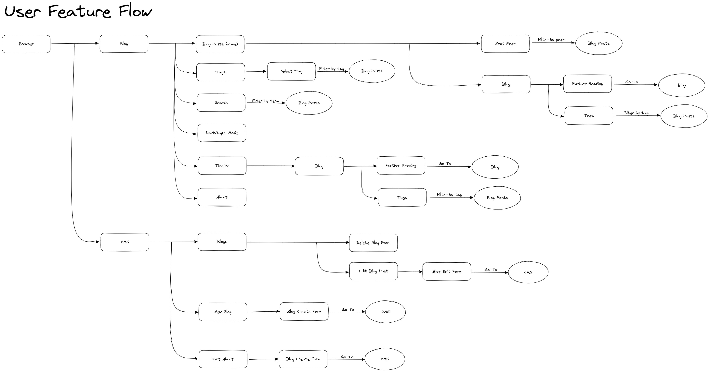
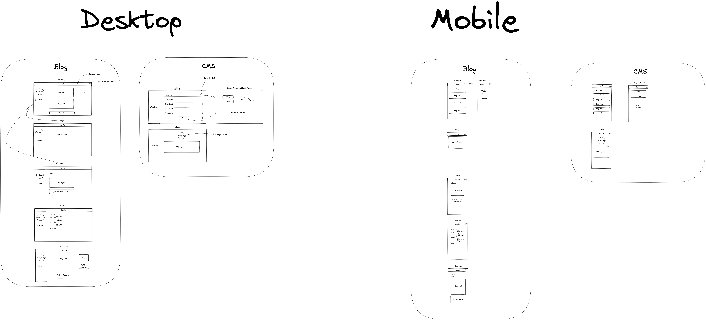

# HCIBlog

This app is a personal blog. It will consist of a simple CMS and a public app which will serve as a blog.
What follows is a list of documentation created in the process of creating the app.

## Features

Resulting document of a feature planning: [Feature Definition](https://docs.google.com/document/d/1oP6uhsQpW26tulFPwT0G2CROAvSM1v0j-ab-uAB3Wg8/edit?usp=sharing)

The following feature flow should give an idea what options does the user have while navigating through the app.



You can find the navigable Excalidraw feature flow on the following link: [Feature Flow](https://excalidraw.com/#json=tP4zEvAsk5tNIshO0zgc_,37spSGQ2mJX1P_KI6yHR6w)

## Low fidelity design

After defining the features we designed the low fidelity design through Excalidraw.



The complete design can be found here: [Low Fidelity Design](https://excalidraw.com/#json=JlYj6othp-i-WbcYVbgJi,Ns_0vlF5PeKeLlgKxxXevw)

## High fidelity design

## Local Development

To run the project locally you first have to build the docker images. To do this simply run the following command

```bash
docker compose -f docker-compose.dev.yml build
```

Once the build is done you can run the containers.

```bash
docker compose -f docker-compose.dev.yml up
```

Contrary to what the logs say, the backend is not running at localhost:8000 and the frontend is not running at localhost:3000.
They are both proxied by the nginx server. Frontend is located at localhost:80 while backend is located at localhost:80/api.

To enter inside a docker container, IE the postgres container (to be able to change the data by hand for example) run the following command:

```bash
docker exec -it <docker_container> <command>
```

Example:

```bash
docker exec -it blog_db psql blog_db -U blogger
```

Hot reloads should be working both for frontend and backend.
